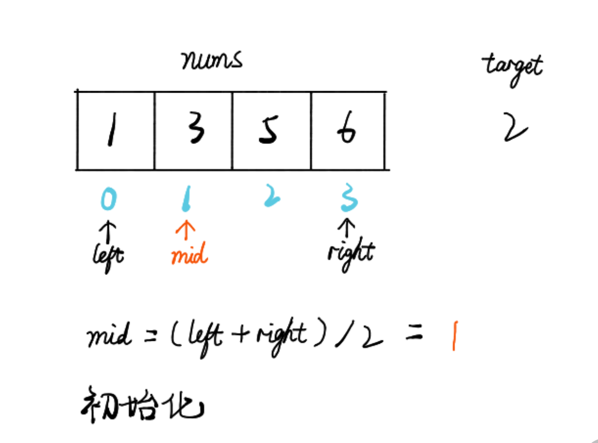

# 35.搜索插入位置

> leetcode地址： https://leetcode-cn.com/problems/search-insert-position/

**解题思路：**



````typescript
function searchInsert(nums: number[], target: number): number {
    let l = 0, r = nums.length;
    while(l < r) {
        const mid = Math.floor((r + l) / 2);
       if (nums[mid] >= target) {
//此时数组中位数大于目标值时，r=mid，继续当mid等于目标值时，应插入值为 mid+1，下次循环 l=mid+1 跳出循环。
            r = mid; 
        } else {
// 当mid一直小于目标值时，左侧值一直右移，直到最后一位后，目标值应为 l = nums.length + 1
            l = mid + 1; 
        }
    }
    return l;
};

nums = [1,3,5,6];
target = 7;
searchInsert(nums, target);
````

