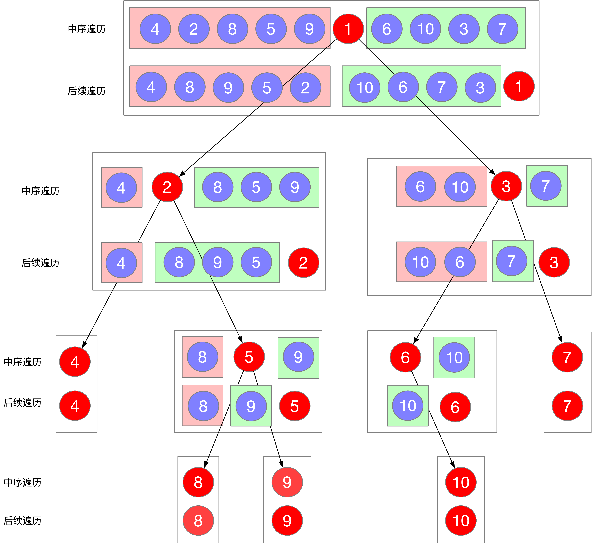

# 106.从中序与后序遍历序列构造二叉树

> LeetCode 地址：https://leetcode.cn/problems/construct-binary-tree-from-inorder-and-postorder-traversal/description/

给定两个整数数组 `inorder` 和 `postorder` ，其中 `inorder` 是二叉树的中序遍历， `postorder` 是同一棵树的后序遍历，请你构造并返回这颗 *二叉树* 。

### 题解

由于题目中要求通过中序和后序遍历的数组来构建二叉树。我们需要通过题目提取以下2个知识点：

- 1. 后序遍历的数组 的最后一个元素是`根节点`
- 1. 在中序遍历的数组中找到对应`根节点`的位置，其左边肯定是它的左子树，右边是它的右子树

接着，我们从根节点开始构建，实现步骤如下：

1. 从后序遍历的数组中 pop 一个值出来，命名为 val，作为树的根节点
2. 从中序遍历的数组中找到 val 的下标 index。
3. 根据第二步返回的 index，切割中序数组。下标 index 为根节点的值，index 左边的数组 是该节点的左子树，index 右边的数组 是该节点的右子树。
4. 分别对右子树和左子树继续遍历，重复第 1-3 步。（**注意：右子树一定会被先构建。由于我们每次遍历都是从 后序数组 中 pop 的一个值，而后序遍历的顺序是左右中。**



```js
/**
 * Definition for a binary tree node.
 * function TreeNode(val, left, right) {
 *     this.val = (val===undefined ? 0 : val)
 *     this.left = (left===undefined ? null : left)
 *     this.right = (right===undefined ? null : right)
 * }
 */
/**
 * @param {number[]} inorder
 * @param {number[]} postorder
 * @return {TreeNode}
 */
var buildTree = function (inorder, postorder) {
  const build = function (leftIndex, rightIndex) {
    // 如果左下标大于右下标，则说明当前节点无法形成二叉树。为空
    if (leftIndex > rightIndex) {
      return null;
    }
    const midVal = postorder.pop(); // 子树的根节点（第一次获取时，为根节点的的值）
    const midNode = new TreeNode(midVal); // 构建二叉树，中间节点
    const midIndex = inorder.indexOf(midVal); // 中间节点在中序数组中的坐标，其左侧为左子树，右侧为右子树
    // 注意：由于后序遍历的顺序是 “左右中”，所以每次从“postorder数组”中pop出来值，一定会先构建出右子树。
    // 即 当从根节点开始构建时，树的构建顺序应该是“中右左”，和遍历顺序相反
    midNode.right = build(midIndex + 1, rightIndex); // 构建右子树
    midNode.left = build(leftIndex, midIndex - 1); // 构建左子树
    return midNode;
  };
  return build(0, postorder.length - 1);
};
```

