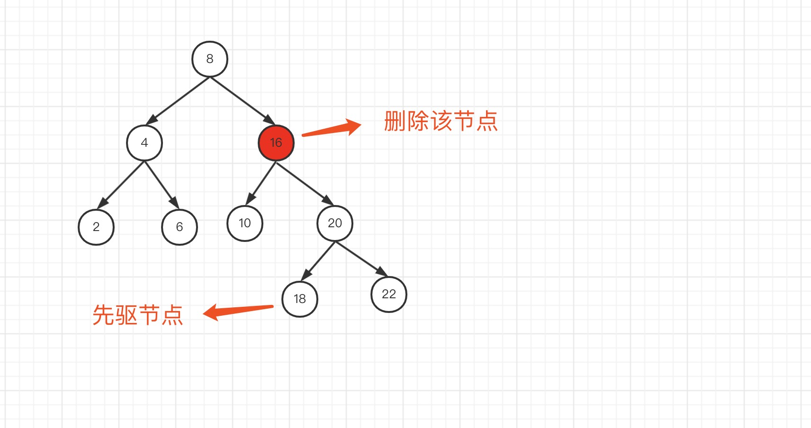
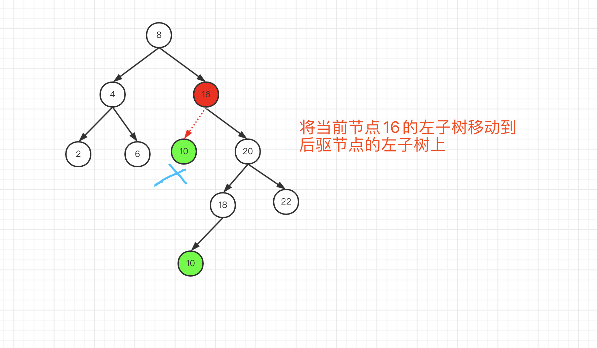
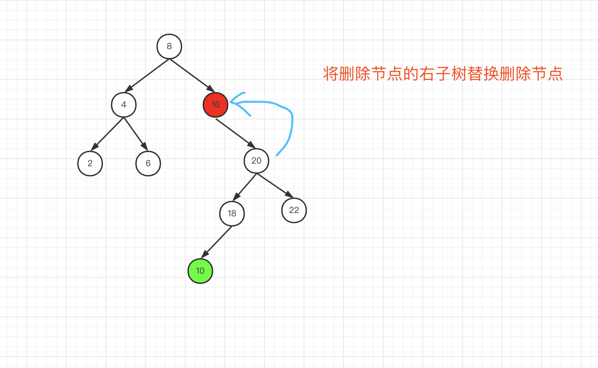
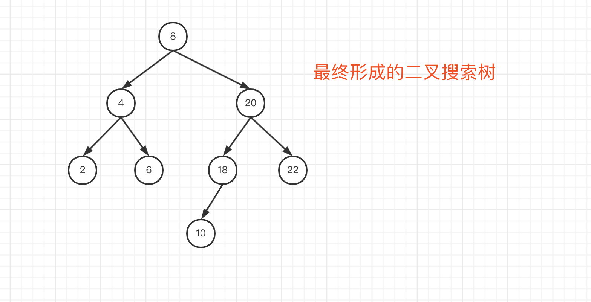

# 450.删除二叉搜索树中的节点

LeetCode 地址：https://leetcode.cn/problems/delete-node-in-a-bst/description/

给定一个二叉搜索树的根节点 **root** 和一个值 **key**，删除二叉搜索树中的 **key** 对应的节点，并保证二叉搜索树的性质不变。返回二叉搜索树（有可能被更新）的根节点的引用。

一般来说，删除节点可分为两个步骤：

1. 首先找到需要删除的节点；
2. 如果找到了，删除它。

#### **解题思路：**

本题考查搜索二叉树的删除方法，之前在[数据结构-二叉树](https://github.com/kerwin-ly/Blog/blob/main/data-structure/二叉树.md)中，我们实现过了一种常见的解法，即：找到树的`先驱`或`后驱`节点替换删除的节点（先驱：目标节点的左子树的最大值所在的节点，后驱：目标节点的右子树的最小值所在的节点）

这里我们用另一种方式进行删除：

1. 首先利用二叉搜索树的特性，查找待删除节点。（如果当前节点比目标值小，则查找其右子树；反之查找左子树）
2. 如果匹配某节点的值等于目标值，则进行条件判断：

第一种：如果该节点左右节点均不存在，则删除该节点，结束

第二种：如果该节点的左子节点存在，右子节点不存在，则将其左子节点替换，结束

第三种：如果该节点的右子节点存在，左子节点不存在，则将其右子节点替换，结束

第四种：如果左右子节点均存在，则获取当前节点的`后驱节点`(当前节点的右子树的最小节点)。然后将当前节点的左子树移到`后驱节点`的左子树上，最后将当前节点的右子节点替换为当前节点。如下图所示：










整体代码如下：

```js
/**
 * Definition for a binary tree node.
 * function TreeNode(val, left, right) {
 *     this.val = (val===undefined ? 0 : val)
 *     this.left = (left===undefined ? null : left)
 *     this.right = (right===undefined ? null : right)
 * }
 */
/**
 * @param {TreeNode} root
 * @param {number} key
 * @return {TreeNode}
 */
var deleteNode = function (root, key) {
    if (!root) {
        return root;
    }
    // 如果当前节点大于目标值，则继续寻找当前节点的左子树
    if (root.val > key) {
        // 返回删除节点后的左子树
        root.left = deleteNode(root.left, key);
    }
    // 如果当前节点小于目标值，则继续寻找当前节点的右子树
    else if (root.val < key) {
        // 返回删除节点后的右子树
        root.right = deleteNode(root.right, key);
    }
    // 如果当前节点与目标值相等
    else {
        // 当前节点为叶子节点，则直接删除
        if (root.left === null && root.right === null) {
            return null;
        }
        // 当前节点仅有左子节点
        else if (root.left && root.right === null) {
            return root.left;
        }
        // 当前节点仅有右子节点
        else if (root.right && root.left === null) {
            return root.right;
        }
        // 当前节点有左右子节点
        else {
            // 寻找当前节点的右子树的最小值，称为后驱
            let rightNode = root.right; // 右子树
            // 一直下沉左子节点
            while (rightNode.left) {
                rightNode = rightNode.left;
            }
            // 将当前节点的左子树赋值给后驱节点的左子树
            rightNode.left = root.left;
            root = root.right; // 将当前子树的根节点替换为根节点的右子节点
            return root;
        }
    }
    return root;
};
```
