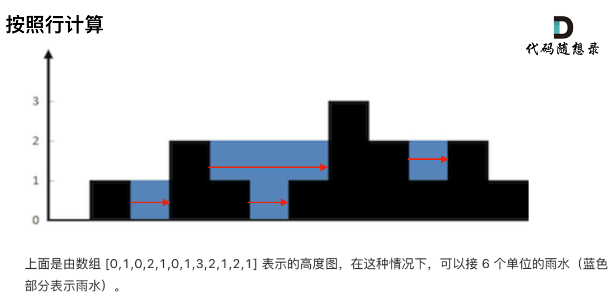

# 42.接雨水

> leetcode地址： https://leetcode.cn/problems/trapping-rain-water/

#### **解题思路：**

接雨水这道题目，我们正需要寻找一个元素，右边最大元素以及左边最大元素，来计算雨水面积。

### [#](https://www.programmercarl.com/0042.接雨水.html#准备工作)准备工作

本题使用单调栈，有如下几个问题：

1. **首先单调栈是按照行方向来计算雨水**，

   如图：



2. **使用单调栈内元素的顺序**

从大到小还是从小到大呢？

从栈头（元素从栈头弹出）到栈底的顺序应该是从小到大的顺序。

因为一旦发现添加的柱子高度大于栈头元素了，此时就出现凹槽了，栈头元素就是凹槽底部的柱子，栈头第二个元素就是凹槽左边的柱子，而添加的元素就是凹槽右边的柱子。如图：


3. 遇到相同高度的柱子怎么办。

遇到相同的元素，更新栈内下标，就是将栈里元素（旧下标）弹出，将新元素（新下标）加入栈中。

例如 5 5 1 3 这种情况。如果添加第二个5的时候就应该将第一个5的下标弹出，把第二个5添加到栈中。

**因为我们要求宽度的时候 如果遇到相同高度的柱子，需要使用最右边的柱子来计算宽度**。


### **处理逻辑**

以下逻辑主要就是三种情况

- 情况一：当前遍历的元素（柱子）高度小于栈顶元素的高度 height[i] < height[st.top()]
- 情况二：当前遍历的元素（柱子）高度等于栈顶元素的高度 height[i] == height[st.top()]
- 情况三：当前遍历的元素（柱子）高度大于栈顶元素的高度 height[i] > height[st.top()]

先将下标0的柱子加入到栈中，`st.push(0);`。 栈中存放我们遍历过的元素，所以先将下标0加进来。

然后开始从下标1开始遍历所有的柱子，`for (int i = 1; i < height.size(); i++)`。

如果当前遍历的元素（柱子）高度小于栈顶元素的高度，就把这个元素加入栈中，因为栈里本来就要保持从小到大的顺序（从栈头到栈底）。

```js
if (height[i] < height[st.top()])  st.push(i);

```

如果当前遍历的元素（柱子）高度等于栈顶元素的高度，要跟更新栈顶元素，因为遇到相相同高度的柱子，需要使用最右边的柱子来计算宽度。

```js
if (height[i] == height[st.top()]) { // 例如 5 5 1 7 这种情况
  st.pop();
  st.push(i);
}
```

如果当前遍历的元素（柱子）高度大于栈顶元素的高度，此时就出现凹槽了。

取栈顶元素，将栈顶元素弹出，这个就是凹槽的底部，也就是中间位置，下标记为mid，对应的高度为height[mid]。

此时的栈顶元素st.top()，就是凹槽的左边位置，下标为st.top()，对应的高度为height[st.top()]。

当前遍历的元素i，就是凹槽右边的位置，下标为i，对应的高度为height[i]。

```js
while (!st.empty() && height[i] > height[st.top()]) { // 注意这里是while，持续跟新栈顶元素
    int mid = st.top();
    st.pop();
    if (!st.empty()) {
        int h = min(height[st.top()], height[i]) - height[mid];  // 高度是 min(凹槽左边高度, 凹槽右边高度) - 凹槽底部高度
        int w = i - st.top() - 1; // 注意减一，只求中间宽度，
        sum += h * w;
    }
}
```

完整代码如下：

```ts
function trap(height: number[]): number {
    const length: number = height.length;
    const stack: number[] = [];// 存着下标，计算的时候用下标对应的柱子高度
    stack.push(0);
    let resVal: number = 0;
    for (let i = 1; i < length; i++) {
        let top = stack[stack.length - 1];
        if (height[top] > height[i]) {// 情况一
            stack.push(i);
        } else if (height[top] === height[i]) {// 情况二
            stack.pop();// 其实这一句可以不加，效果是一样的，但如果遇到相同的值会重复计算一次
            stack.push(i);
        } else {// 情况三
            while (stack.length > 0 && height[top] < height[i]) {
                let mid = stack.pop();
                if (stack.length > 0) {
                    let left = stack[stack.length - 1];
                    let h = Math.min(height[left], height[i]) - height[mid]; 
                    let w = i - left - 1; // 注意减一，只求中间宽度 例如左侧下标为2，右侧下标为4 则宽度应该-1
                    resVal += h * w; // 计算当前凹槽的雨水体积
                    top = stack[stack.length - 1]; // 更新栈顶元素下标
                }
            }
            stack.push(i);
        }
    }
    return resVal;
};
```

