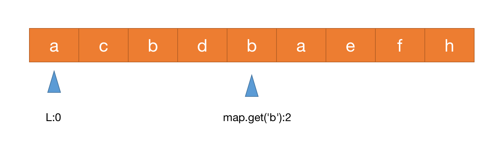

# 3.无重复字符的最长子串

> leetcode地址： https://leetcode.cn/problems/longest-substring-without-repeating-characters/

#### **解题思路：**

**本题可以用滑动窗口的思路求解**

我们使用两个指针表示字符串中的某个子串（或窗口）的左右边界，其中左指针代表着上文中「枚举子串的起始位置」，而右指针跟随循环更新。

在每一步的操作中，我们会将左指针向右移动一格，表示 我们开始枚举下一个字符作为起始位置，然后我们可以不断地向右移动右指针，但需要保证这两个指针对应的子串中没有重复的字符。在移动结束后，这个子串就对应着 以左指针开始的，不包含重复字符的最长子串。我们记录下这个子串的长度；

在枚举结束后，我们找到的最长的子串的长度即为答案。

步骤如下：

1.设置一个`map`标识每个字符最新出现的位置
2.循环判断每个位置的字符是否已记录在`map`中，若存在，则更新当前记录最长子串开始位置`l`，如下图循环第二次出现的b时,取当前`l`值与字符`b`标识值下一个位置的最大值，`l`变为3



3.`r-l`获取目前不重复子串长度，更新size值
4.重复第2、3步

```js
/**
 * @param {string} s
 * @return {number}
 */
var lengthOfLongestSubstring = function(s) {
    if (!s) return 0;
    let map = new Map(),
        left = 0, // 左指针
        right = 0, // 右指针
        size = 0;
    while (right < s.length) {
        if (map.has(s[right])) { // 当前哈希表存在重复值时，直接把左指针移动到第一个重复字符的下一个位置
            left = Math.max(left, map.get(s[right]) + 1); // [当前左指针，当前重复元素的第一个坐标的下一个位置]
        }
        map.set(s[right], right);
        right++;
        size = Math.max(size, right - left); // 获取size最大值
    }
    return size
};
```

