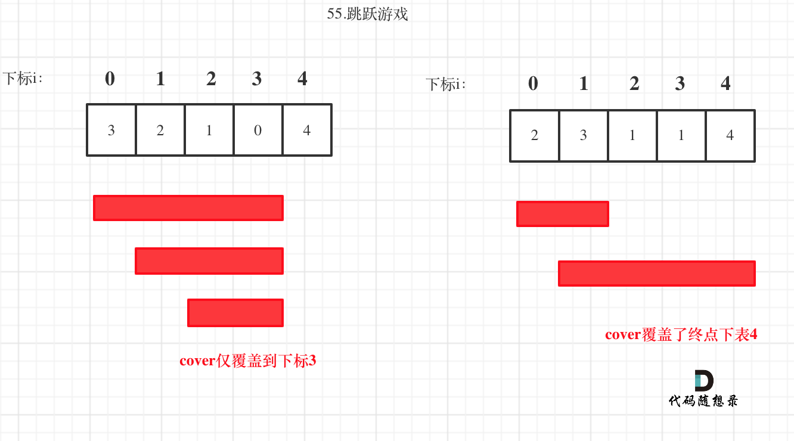

# 55.跳跃游戏

> leetcode地址： https://leetcode.cn/problems/jump-game/

#### **解题思路：**

这道题目关键点在于：不用拘泥于每次究竟跳几步，而是看覆盖范围，覆盖范围内一定是可以跳过来的，不用管是怎么跳的。

这个范围内，别管是怎么跳的，反正一定可以跳过来。**那么这个问题就转化为跳跃覆盖范围究竟可不可以覆盖到终点！**

每次移动取最大跳跃步数（得到最大的覆盖范围），每移动一个单位，就更新最大覆盖范围。

**贪心算法局部最优解：每次取最大跳跃步数（取最大覆盖范围），整体最优解：最后得到整体最大覆盖范围，看是否能到终点**。

局部最优推出全局最优，找不出反例，试试贪心！



如果cover大于等于了终点下标，直接return true就可以了。

```typescript
function canJump(nums: number[]): boolean {
    let cover = 0;
    if (nums.length === 1) return true;
    for (let i = 0; i <= cover; i++) { //在覆盖范围内循环
        cover = Math.max(cover, i + nums[i]); // 更新覆盖范围，取当前可覆盖范围里最大的。
        if (cover >= (nums.length - 1)) return true; // 如果当前覆盖范围大于等于终点下标，则为true
    }
    return false;
};
```


