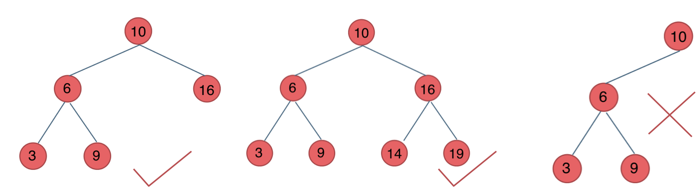
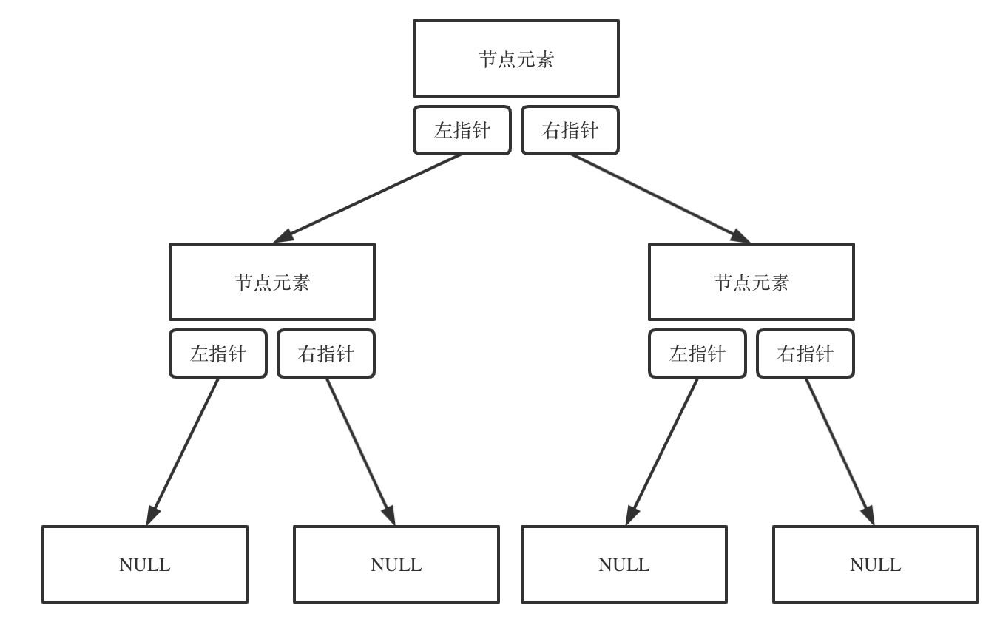

# 二叉树

## **树的概念**

- 树是一种**非线性**的数据结构，相对于线性的数据结构(链表、数组)而言，**树的平均运行时间更短(往往与树相关的排序时间复杂度都不会高)**。


## 二叉树

> 二叉树的特点是：“**叶子节点的位置比较规律**”。因此在对数据进行**排序或者查找**时可以用到它，比如**堆排序**就使用了它。


- 至少有一个节点（根节点）。

- 节点由一个数据和两个指针组成。

- 每个子节点不能多于两个子级。

  


#### 满二叉树

> 如果一棵二叉树只有度为0的结点和度为2的结点，并且度为0的结点在同一层上，则这棵二叉树为满二叉树。

也可以说深度为k，有2^k-1个节点的二叉树。如图所示：


#### 完全二叉树

> 在完全二叉树中，除了最底层节点可能没填满外，其余每层节点数都达到最大值，并且最下面一层的节点都集中在该层最左边的若干位置。若最底层为第 h 层，则该层包含 1~ 2^(h-1)  个节点。


#### 二叉搜索树

> 前面介绍的树，都没有数值的，而二叉搜索树是有数值的了，**二叉搜索树是一个有序树**。

- 若它的左子树不空，则左子树上所有结点的值均小于它的根结点的值。
- 若它的右子树不空，则右子树上所有结点的值均大于它的根结点的值。
- 它的左、右子树也分别为二叉排序树。


#### 平衡二叉搜索树

> 平衡二叉搜索树，它是一棵空树或它的左右两个子树的高度差的绝对值不超过1，并且左右两个子树都是一棵平衡二叉树。




## 二叉树存储方式

- 分为链式存储（指针）、顺序存储（数组）。
- 顺序存储连续分布于内存中。
- 链式存储通过指针把散落在各个地址的节点串联一起。


**顺序存储：**


> 二叉树数组遍历方式，如果父节点的数组下标是i，那么其左孩子是**i \* 2 + 1**，右孩子是是 **i \* 2 + 2**。


**链式存储：**




## 二叉树遍历方式

> **这里前中后，其实指的就是中间节点的遍历顺序**，只要大家记住 前中后序指的就是中间节点的位置就可以。

- **深度优先遍历**（先往深走，遇到叶子节点再往回走）
  - 前序遍历：中左右
  - 中序遍历：左中右
  - 后序遍历：左右中
- **广度优先遍历**（一层一层的去遍历）
  - 层次遍历


#### 使用场景

1 一般使用**递归**实现深度优先遍历，**栈就是递归的一种实现结构**，故前中后序遍历可以**借助栈使用非递归**的方式实现。

2 广度优先遍历一般使用**队列**实现，需要先进先出的结构，才能一层一层的遍历二叉树。


二叉树实现：

````typescript
class TreeNode {
    public val: number;
    public left: TreeNode | null;
    public right: TreeNode | null;
    constructor(val?: number, left?: TreeNode, right?: TreeNode) {
        this.val = val === undefined ? 0 : val;
        this.left = left === undefined ? null : left;
        this.right = right === undefined ? null : right;
    }
}
````

