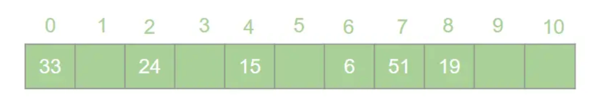
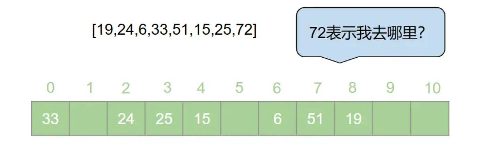
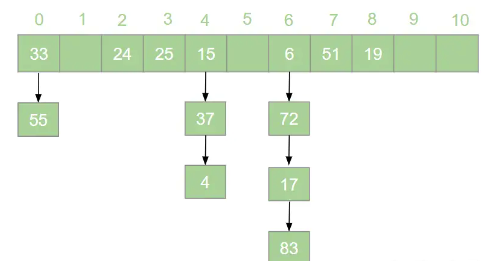
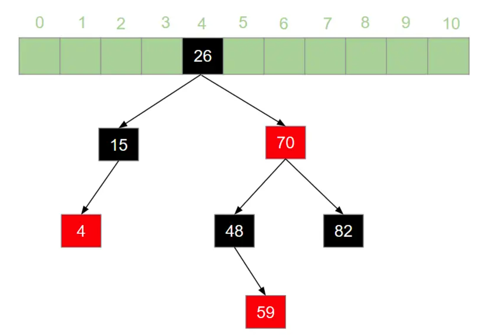

# 哈希表

数组即哈希表。哈希表就是通过一个映射函数f(key)将一组数据散列存储在数组内中的一种数据结构。

- 包含**元素**和**索引**两部分，关键码为数组的索引下标，通过下标直接访问数组的元素。

- **空间利用率不高**，有很多空单元格来防止数据存储冲突。是一种`空间`换`时间`的方式。

- 一般哈希表**用来快速判断一个元素是否出现在集合中**。

- 与枚举不同 o(n)，**哈希表的查询时间复杂度为o(1)**。

  

如查询学生名字是否在这所学校，初始化时将名字映射到哈希表内（hash function），查询时通过索引即可查询到。


## 哈希函数（hash function）

举个例子，有一组数据：[19,24,6,33,51,15]，我们用**散列存储**的方式将其存储在一个长度为11的数组中。采用**除留取余法**，将这组数据分别模上数组的长度（即f(key)=key % 11），以余数作为该元素在数组中的存储的位置。则会得到一个如下图所示的哈希表：



此时，如果我们想从这个表中找到值为15的元素，只需要将15模上11即可得到15在数组中的存储位置。

如果数组的数量大于哈希表的大小怎么办，此时就算哈希函数计算的再均匀，也避免不了会有几位数组值同时映射到哈希表 同一个索引下标的位置。

接下来**哈希碰撞**登场。


## 哈希碰撞

在上面的数组内再添加两个数字，得到数组[19,24,6,33,51,15,25,72]，新元素25模11后得到3，对72模11之后得到了6，但6已经被其他元素占据。




一般情况下，哈希冲突只能尽可能的减少，但不可能完全避免。常用的处理方法有：


- **链地址法**（常用）

  在哈希冲突时，将冲突的元素以链表的形式存储，哈希地址为**i**的元素都插入到同一个链表中。可为**头插法**/**尾插法**。

  如新数组 [19,24,6,33,51,15,25,72,37,17,4,55,83]。链地址法的到如下哈希表。

  

  


但在极端条件下，链地址法可能会导致链表长度过长，退化为链表。查找元素复杂度退化为o(n)。故可使用二叉树进行优化，将链表变为**红黑二叉树**（可自平衡），查询的时间复杂度为o(lgn)。优化哈希表查询效率。




- **开放地址法**

  按照某种方法（**线性探测**，**二次探测**）继续探测哈希表中的空白存储单元。

  **线性探测**：比如 72模11后得到6，6已被占用，则查看6+1的到7的位置是否被占用，否则继续+1，直到插入空白位置。

  **二次探测**：方式为原哈希地址加上d  (d= ±1^2、±2^2、±3^2......±m^2)。如求得72的哈希地址为5。


- **再哈希法**

  再哈希法即选取若干个不同的哈希函数，在产生哈希冲突的时候计算另一个哈希函数，直到不再发生冲突为止。


- **建立公共溢出区**

​       专门维护一个溢出表，当发生哈希冲突时，将值填入溢出表。


哈希表实现：


````typescript
class HashTable {
  //   初始化哈希表
  constructor(size) {}
    //  从哈希表中取值
    get() {}
    //  向哈希表中填值
    insert() {}
    //  从哈希表中删除数据
    delete() {}
    //  判断哈希表中存不存在该值
    hash() {}
    show() {}
}


// by 司徒正美- 不做冲突处理
class Hash{
    constructor(){
        this.table = new Array(1024);
    }
    hash(data) {
    //就将字符串中的每个字符的ASCLL码值相加起来，再对数组的长度取余
        var total = 0;
        for(var i = 0; i < data.length; i++) {
            total += data.charCodeAt(i);
        }
        console.log("Hash Value: " +data+ " -> " +total);
        return total % this.table.length;
    }
    insert(key, val){
        var pos = this.hash(key);
        this.table[pos] = val;
    }
    get(key){
        var pos = this.hash(key);
        return this.table[pos] 
    }
    show(){
        for(var i = 0; i < this.table.length; i++) {
            if(this.table[i] != undefined) {
                console.log(i + ":" +this.table[i]);
            }
        }
    }
    }
    var someNames = ["David","Jennifer","Donnie","Raymond","Cynthia","Mike","Clayton","Danny","Jonathan"];
    var hash = new Hash();
    for(var i = 0; i < someNames.length; ++i) {
    hash.insert(someNames[i],someNames[i]);
    }
    
    hash.show(); 
````

