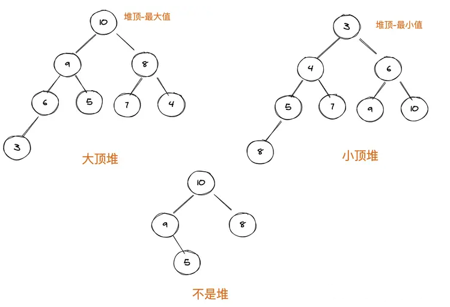

# 堆

> 大部分时候使用数组来存储堆。堆是一种特殊的树，满足如下条件。

- 完全二叉树

  - 除最后一层，其他层的节点个数都是满的，最后一层的节点几种在左侧子树。

- 堆中每个节点的值必须大于等于（或小于等于）起左右子节点的值。

- > 每个节点都大于等于其子树节点的堆叫**大顶堆**，根是最大值。

- > 每个节点都小于等于其子树节点的堆叫**小顶堆**，根是最小值。





## 堆的操作

堆的操作主要有两种：插入、删除。

> 在插入或删除操作后需要进行调整，让其重新满足堆的特性，调整过程叫堆化（heapify）。


首先，初始化一个堆基本方法

````typescript
class Heap {
  constructor(arr) {
    // 堆从下标1开始，0作为哨兵，存储最大（小）值
    this.data = arr;
    this.size = arr.length - 1;
  }

  // 交换值
  swap(indexOne, indexTwo) {
    // const tmp = this.data[indexOne];
    // this.data[indexOne] = this.data[indexTwo];
    // this.data[indexTwo] = tmp;
    [this.data[indexOne], this.data[indexTwo]] = [this.data[indexTwo], this.data[indexOne]];
  }

  // 获取左子节点的下标
  getLeftChildIndex(i) {
    return i * 2;
  }

  // 获取右子节点的下标
  getRightChildIndex(i) {
    return i * 2 + 1;
  }

  // 获取左子节点值
  getLeftChildItem(index) {
    return this.data[this.getLeftChildIndex(index)];
  }

  // 获取右子节点值
  getRightChildItem(index) {
    return this.data[this.getRightChildIndex(index)];
  }

  // 获取父节点下标
  getParentIndex(childIndex) {
    return Math.floor(childIndex / 2);
  }

  // 获取父节点值
  getParentItem(index) {
    return this.data[this.getParentIndex(index)];
  }

  // 判断某下标是否还有父节点
  hasParent(childIndex) {
    return this.getParentIndex(childIndex) >= 0;
  }

  // 判断是否含有子节点
  hasLeftChild(parentIndex) {
    return this.getLeftChildIndex(parentIndex) <= this.size;
  }

  // 判断是否含有右子节点
  hasRightChild(parentIndex) {
    return this.getRightChildIndex(parentIndex) <= this.size;
  }
}
const h1 = new Heap([, 10, 4, 6, 7, 3, 23, 89, 45]);

````


#### 插入

> 在堆的尾部插入，满足完全二叉树的条件，再进行堆化。

需要进行**自下往上堆化**，新插入的节点与父节点对比大小，如果新插入的节点大于父节点，就交换两个节点。一直重复，直到满足堆的条件。

````typescript
class Heap {
  ...初始化堆
  // 自下而上，对堆中元素进行替换
  heapifyUp(customStartIndex) {
    let currentIndex = customStartIndex || this.size;
    let parentIndex = this.getParentIndex(currentIndex);

    // 插入最后位置的元素，挨个与父级元素比较。
    // 如果插入元素比父级元素大，则与父级元素交换位置
    // 如果插入元素比父级元素小，则表明当前有序性正确，是大顶堆
    while (
      this.hasParent(currentIndex) &&
      this.data[parentIndex] < this.data[currentIndex]
    ) {
      this.swap(parentIndex, currentIndex);
      currentIndex = parentIndex;
      parentIndex = this.getParentIndex(currentIndex);
    }
  }

  // 插入
  add(item) {
    this.data.push(item); // 1.将插入元素放在数组最后一个位置，首先保证结构性
    this.size++;
    this.heapifyUp(); // 2.再根据各个父子节点值的大小，逐个调整树节点位置
    return this;
  }
}
const h1 = new Heap([, 10, 4, 6, 7, 3, 23, 89, 45]);

h1.add(100);
````


#### 删除

> 因为堆的特性，顶部一般表示最大/最小值，故在堆的顶部删除，在进行堆化。

删除堆顶元素后，将最后一个节点放到堆顶，在子节点中找出较大（大顶堆）的那个对比。小于子节点时，呼唤两个节点，并且重复进行这个过程，即**自上往下的堆化**。

````typescript
class Heap {
  ...初始化堆
  // 自上而下，对堆中元素进行替换
  heapifyDown(customStartIndex = 1) {
    let currentIndex = customStartIndex;
    let nextIndex = null;

    // 当有子节点时
    while (this.hasLeftChild(currentIndex)) {
      // 取左子节点和右子节点的较大值
      if (
        this.hasRightChild(currentIndex) &&
        this.getRightChildItem(currentIndex) >
          this.getLeftChildItem(currentIndex)
      ) {
        nextIndex = this.getRightChildIndex(currentIndex);
      } else {
        nextIndex = this.getLeftChildIndex(currentIndex);
      }
      // 如果当前节点比左右子节点的较大值还大，则表明有序性已满足，退出循环。
      if (this.data[currentIndex] > this.data[nextIndex]) {
        break;
      }
      // 如果当前节点比左右子节点的较大值小，将左右子节点的较大值和当前节点进行交换
      this.swap(currentIndex, nextIndex);
      currentIndex = nextIndex;
    }
  }

 // 删除堆顶元素
  pop() {
    this.data[1] = this.data.pop();
    this.size--;
    this.heapifyDown();
  }

  // 删除（一般情况，我们仅维护堆顶元素，删除也是堆顶元素。因为随意删除中间的元素，不知道其意义）
  remove(removeIndex) {
    if (removeIndex >= this.size) {
      return;
    }
    // 如果删除的是最后一个元素，则保证了堆的特征
    if (removeIndex === this.size) {
      this.data.pop();
      this.size--;
      return;
    }
    this.data[removeIndex] = this.data.pop(); // 将末尾的元素放置到删除位置上，保证堆的结构性
    this.size--;
    const parentItem = this.getParentItem(removeIndex);
    // 如果父元素比替换的元素小，则向上查找替换元素的正确位置
    // 否则，向下查找替换元素的正确位置
    if (parentItem && parentItem < this.data[removeIndex]) {
      this.heapifyUp(removeIndex);
    } else {
      this.heapifyDown(removeIndex);
    }
  }

}
const h1 = new Heap([, 10, 4, 6, 7, 3, 23, 89, 45]);

h1.pop();
````


**堆化时间复杂度**

> 堆化的过程是顺着节点所在路径比较交换的，所以堆化的时间复杂度跟树的高度成正比，也就是O(logn)。


**插入和删除时间复杂度**

> 插入数据和删除堆顶元素的主要逻辑就是堆化，所以时间复杂度都是O(logn)。


## 堆排序

> **大顶堆**用于升序排列

> **小顶堆**用于降序排列

实现排序分为建堆和排序两个操作。

排序过程需要堆n个元素进行堆化，堆化的时间复杂度是O(logn)。所以排序过程的时间复杂度是O(nlogn)。


#### 大顶堆实现

````typescript
class Heap {
  ...初始化堆

// 构造大顶堆
  maxHeapify(i) {
    while (true) {
      let max = i;
      if (i > this.size) {
        return;
      }
      let left = this.getLeftChildIndex(i);
      let right = this.getRightChildIndex(i);

      if (left <= this.size && this.data[left] > this.data[max]) {
        max = left;
      }
      if (right <= this.size && this.data[right] > this.data[max]) {
        max = right;
      }
      if (max === i) {
        break;
      }
      this.swap(i, max);
      i = max;
    }
  }

  // 构建大顶堆
  buildMaxHeap() {
    const lastParentIndex = Math.floor(this.size / 2); 
    // 最后一个非叶子节点开始（即：最后一个有子节点的节点开始）

    for (let i = lastParentIndex; i >= 1; --i) {
      this.maxHeapify(i);
    }
  }

  // 构建最大堆排序
  sort() {
    this.buildMaxHeap();
    for (let i = this.data.length - 1; i > 1; i--) {
      this.swap(1, i);
      this.size--;
      this.maxHeapify(1);
    }
  }

}
const h1 = new Heap([, 10, 4, 6, 7, 3, 23, 89, 45]);

h1.sort();
````


**小顶堆实现**

````typescript
class Heap {
  ...初始化堆

// 构造大顶堆
  maxHeapify(i) {
    while (true) {
      let max = i;
      if (i > this.size) {
        return;
      }
      let left = this.getLeftChildIndex(i);
      let right = this.getRightChildIndex(i);

      if (left <= this.size && this.data[left] > this.data[max]) {
        max = left;
      }
      if (right <= this.size && this.data[right] > this.data[max]) {
        max = right;
      }
      if (max === i) {
        break;
      }
      this.swap(i, max);
      i = max;
    }
  }

  // 构建大顶堆
  buildMinHeap() {
    const lastParentIndex = Math.floor(this.size / 2); 
    // 最后一个非叶子节点开始（即：最后一个有子节点的节点开始）

    for (let i = lastParentIndex; i >= 1; --i) {
      this.maxHeapify(i);
    }
  }

  // 构建最小堆排序
  sort() {
    this.buildMinHeap();
    for (let i = this.data.length - 1; i > 1; i--) {
      this.swap(1, i);
      this.size--;
      this.maxHeapify(1);
    }
  }

}
const h1 = new Heap([, 10, 4, 6, 7, 3, 23, 89, 45]);

h1.sort();
````

