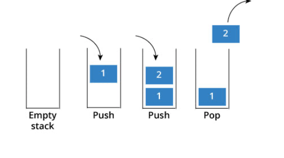

# 栈

- 栈的所有元素符合**先进后出**规则，限制只能在栈的一端对栈进行插入、删除。

栈常用来解决任意进制转换问题、汉罗塔问题。

提供方法如图：



````typescript
function Stack() {
  this.items = [];

  // 压栈
  Stack.prototype.push = function(element) {
    this.items.push(element);
  };

  // 从栈中取出
  Stack.prototype.pop = function() {
    return this.items.pop();
  };

  // 查看栈顶元素
  Stack.prototype.peek = function() {
    return this.items[this.items.length - 1];
  };

  // 判断栈是否为空
  Stack.prototype.isEmpty = function() {
    return this.items.length === 0;
  };

  // 获取栈中元素的个数
  Stack.prototype.size = function() {
    return this.items.length;
  };

  // toString方法
  Stack.prototype.toString = function() {
    var resultStr = "";
    for (let i = 0; i < this.items.length; i++) {
      resultStr += i;
    }
    return resultStr;
  };
}

const list = new Stack();


// 例子十进制转二进制问题
function divideBy2(decNumber) {
    var remStack = new Stack(),
        rem,
        binaryString = '';
    while (decNumber > 0) {
        rem = Math.floor(decNumber % 2);
        remStack.push(rem);
        decNumber = Math.floor(decNumber / 2);
    }
    while(!remStack.isEmpty()) {
        binaryString += remStack.pop().toString();
    }
    return binaryString;
}

// 任意进制转换的算法
function baseConverter(decNumber, base) {
    var remStack = new Stack(),
        rem,
        binaryString = '',
        digits = '0123456789ABCDEF';
    while (decNumber > 0) {
        rem = Math.floor(decNumber % base);
        remStack.push(rem);
        decNumber = Math.floor(decNumber / base);
    }
    while(!remStack.isEmpty()) {
        binaryString += digits[remStack.pop()].toString();
    }
    return binaryString;
}

````


