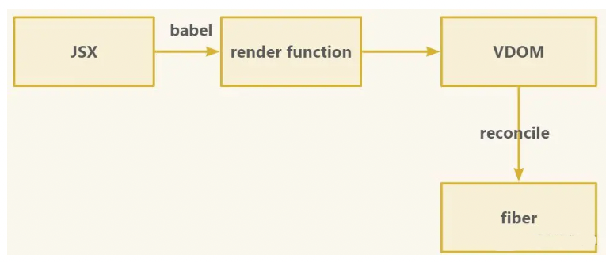

## React18 有哪些更新

#### 1 setState 自动批处理

React17 中，只有 react 事件会进行批处理，原生 j s 事件，promise、setTimeout、setInterval 等则不会。

**React18 中，将所有事件都进行批处理，即多次 setState 会被合并为 1 次执行，提高了性能**。在数据层，将多次状态更新合并成一次处理（在视图层，将多次渲染合并成一次渲染）。

#### 2 引入新 root API,支持 new concurrent renderer（并发模式的渲染）

```javascript
//React 17
import React from "react";
import ReactDOM from "react-dom";
import App from "./App";

const root = document.getElementById("root");
ReactDOM.render(root, <App />);

// 卸载组件
ReactDOM.unmountComponentAtNode(root);

// React 18
import React from "react";
import ReactDOM from "react-dom/client";
import App from "./App";
const root = document.getElementById("root");
ReactDOM.createRoot(root).render(<App />);

// 卸载组件
root.unmount();
```

#### 3 strict mode 更新

**当使用严格模式时，React 对每个组件返回两次渲染**，在 React17 中去掉了一次渲染的控制台日志。React18 取消了这个限制，第二次渲染会以浅灰色出现在控制台日志。

#### 4 React18 在 render 中删除了回调函数，如果需要使用回调，可以通过 useEffect 实现。

```javascript
// React 17
const root = document.getElementById('root')!;
ReactDOM.render(<App />, root, () => {
  console.log('finish render');
});

// React 18
const AppWithCallback: React.FC = () => {
  useEffect(() => {
    console.log('finish render (v18)');
  }, []);
  return <App />;
};
const root = document.getElementById('root')!;
ReactDOM.createRoot(root).render(<AppWithCallback />);
```

#### 5 Concurrent Mode

并发模式不是一个功能，而是一个底层设计。

它可以帮助应用保持响应。通过渲染可终端来修复阻塞渲染机制。在并发模式中，react 可以同时更新多个状态，**使同步不可中断更新变成了异步可中断更新**。

#### 6 Suspence 不再需要 fallback 捕获

**Suspence 的作用是划分页面中需要并发渲染的部分，和 lazy 一起使用服务于优化打包，可以显著减少主包体积，提升用户体验。**

React17 中，如果 Suspence 没有提供 fallback 属性，React 会跳过继续向上搜索下一个边界，这可能导致难以调试。比如 debug 在没有 fallback 的 Suspence 组件中抛出一个边界问题进行测试，不会触发警告报错。

React18 将当前组件的 Suspence 的值默认设置为 null 或 undefined。

```javascript
// React 17
const App = () => {
  return (
    <Suspense fallback={<Loading />}> // <--- 这个边界被使用，显示 Loading 组件
      <Suspense>                      // <--- 这个边界被跳过，没有 fallback 属性
        <Page />
      </Suspense>
    </Suspense>
  );
};
// React 18
const App = () => {
  return (
    <Suspense fallback={<Loading />}> // <--- 不使用
      <Suspense>                      // <--- 这个边界被使用，将 fallback 渲染为 null
        <Page />
      </Suspense>
    </Suspense>
  );
};
export default App;

```

## React 设计思想

- 组件化 - 组件符合开闭原则，渲染工作流封闭，组件通信通过 props 进行数据交互开放。
- 数据驱动视图 - UI = f(data) 通过修改数据（state 或 prop），数据驱动视图更新。
- 虚拟 DOM - 是对真实 DOM 的映射，通过新旧虚拟 DOM 对比，得到需要更新部分，实现数据增量更新。

## React 生命周期

组件生命周期分为**挂载**、**更新**、**卸载**阶段

**挂载：**

- **constructor** 进行 state 和 props 的初始化
- render
- **componentDidMount** 第一次渲染后调用，可以访问 DOM 进行异步请求和定时器、消息订阅。

**更新：**

- 组件的 state 或 props 变化时触发更新
- **shouldComponentUpdate**返回布尔值，默认为 true。设置 true / false 确认是否更新组件，提高性能。
- render
- **componentDidUpdate** 在组件更新后调用

**卸载：**

- **componentWillUnMount** 组件从 DOM 中被移除时调用

**错误捕获：**

- **componentDidCatch**


## state 和 props 触发更新的生命周期分别有什么区别？

区别在于props增加了componentWillReceiveProps调用，用来比较当次porps和下次的是否相同。


## React 事件机制

> 通过在document处监听所有事件，当事件冒泡到document时，react将事件内容封装合成交由真正的处理函数运行，通过事件池复用而不是创建事件对象，解决了内存分配问题。

React 基于浏览器实现的事件机制，包含**事件触发**、**事件冒泡**、**事件捕获**、**事件合成**和**事件派发**。

#### react 事件机制和原生 DOM 事件流有什么区别？

虽然合成事件不是原生 DOM 事件，但它包含了原生 DOM 事件的引用，可以通过 e.nativeEvent 访问。

#### **dispatchEvent 是怎么实现事件分发的**？

事件触发的本质是对dispatchEvent函数的调用，给事件对象绑定自定义事件。


## React性能优化手段

- 组件设置是否更新 - **shouldComponentUpdate**
- useMemo
- getDerviedStateFromProps
- 使用Fragment - 允许你将子列表分组，而无需向 DOM 添加额外节点
- v-for使用正确的key
- 拆分尽可能小的可复用组件，ErrorBoundary
- 使用React.lazy和React.Suspense延迟加载不需要立马使用的组件


## React组件间通讯方式

#### **父 > 子通信：**

- props传递

#### **子 > 父通信：**

- 回调函数，父组件向子组件传递一个函数，通过函数回调，拿到子组件传过来的值
- 事件冒泡，点击子组件的button按钮，事件会冒泡到父组件上
- Ref，createRef创建ref。将其赋值给一个变量，通过ref挂载在dom节点或组件上，该ref的current属性将拿到dom节点或组件的实例

#### 兄弟组件通信：

- 实际上就是通过父组件中转数据的，子组件a传递给父组件，父组件再传递给子组件b

#### **父组件向后代组件通信**

- Context ：相当于大容器，通信内容放在容器里，不管嵌套多深，可以随意取用。


## React hooks

**优点：**

- 告别难以理解的class组件
- 解决业务逻辑难以拆分的问题
- 使状态逻辑复用变得简单可行
- 函数组件的设计理念更符合React规范

**局限性：**

- hooks不能完整的为函数组件提供类组件的能力
- 函数组件要求行更高
- hooks在使用层面有严格的规则约束


## React 高阶组件HOC、Render props、hooks 有什么区别

- HOC：一种组件设计模式，纯函数。优缺点：逻辑复用且独立 / 重名组件会被覆盖
- props：组件间元素函数或值传递。优缺点：数据共享 / 无法在return语句外访问
- hooks：解决了hoc的prop覆盖及回调地狱问题。优缺点：解决代码复用问题 / 只能在组件顶层使用


## React 类组件与函数式组件区别

- 类组件有生命周期，函数组件没有
- 类组件需要继承 Class，函数组件不需要
- 类组件可以获取实例化的 this，并且基于 this 做各种操作，函数组件不行
- 类组件内部可以定义并维护 state， 函数组件都称为无状态了，那肯定不行。
- 性能优化上：类组件依靠shouldComponentUpdate阻断，函数组件依靠memo缓存渲染结果。


## 受控组件和非受控组件

**受控组件**：比如表单input，当表单状态变化时，会触发onchange事件，更新组件state。组件的状态与value对应，消除了局部状态。

优缺点：值由react组件管理，当组件过多时，需要单独写事件处理函数，代码臃肿。

**非受控组件**：如果表单中没有value prop时，用ref来获取表单值，就不需要单独写数据维护函数。

总结：页面中所有输入如果是现用现取的称为非受控组件，而通过setState维护的称为受控组件。


## setState是同步还是异步

**setState是一个异步方法，但是在setTimeout / setInterval等定时器里会逃脱React的掌控，变成同步方法。**

实现机制类似于事件循环，每个setState都会被加入到任务队列。

多次对同一个state使用setState指挥返回最后一次的结果，先放在队列里，等时机成熟后执行批量更新。

React18使用了createRoot api后，所有setState都是异步批量执行。


## state和props有什么区别？

- props：外部传入，可读性、不变性，仅外部传入新值重新渲染。
- state：构造器中初始化，私有属性，不可外部访问或修改。修改会导致重新渲染。


## mobx和redux有什么区别？

**redux**： 工作流程，createStore  -->  action定义行为   ---> dispatch触发事件      ---> reducer 处理state, 返回新的state

**mobx**：工作流程，createStore  -->  action定义行为 --- > 监听事件   --->   触发订阅 ---> 修改state值

redux 是在 reducer 函数里组织状态，mobx 则是在 class 里组织状态。


## useState为什么用数组而不是对象？

主要是为降低使用复杂度，返回数组可以直接解构赋值，对象的话多次使用需要定义别名。


## hooks实现原理

hooks基于函数式组件，将数据和渲染绑定，解决了纯函数组件无法实现全功能组件的问题，以钩子的形式提供。

相比class组件成本高，组件复杂和难以拆分复用的问题。

解决的问题：

1. 组件之前复用状态逻辑
2. 拆分更小粒度函数，降低复杂组件难度
3. 拥抱函数，比class组件更易于理解

局限性：

- 不能在循环、条件或嵌套函数中调用hook。 --- hook基于数组实现，循环等条件调用可能导致数组取值错位，执行错误的hook。
- 只能在react的函数组件中调用hook。 --- hook基于函数组件设计。


## 虚拟DOM的理解？

将页面状态抽象为js对象，合并多次dom修改结果，减少渲染次数。每渲染一次，虚拟dom都会缓存一次进行diff比较，决定渲染范围。


## Fiber架构

#### 什么是Fiber，Fiber解决了什么问题？

**在React16以前，更新是通过树的深度优先遍历完成的**，遍历无法中断，当树的层级过深会产生栈的层级过深，页面渲染速度变慢。

故引入了Fiber，**React Fiber就是虚拟DOM，他是一个链表，返回return、children、siblings**，分别代表父Fiber，子Fiber和兄弟Fiber。

**Fiber是纤程，比线程更精细，表示对渲染线程实现更精细的控制，具备可中断、可恢复的特性。**

#### 应用目的

实现增量渲染，即是把一个渲染任务分解为多个渲染任务，具备可中断、可恢复的特性，按照优先级处理任务，达到更顺滑的用户体验。

#### **Fiber的可中断、可恢复怎么实现的**

Fiber是协程，比线程更小的单元，可以人为中断和恢复。因此我们通过Fiber把浏览器渲染分段执行，每执行一段时间就让出主线程控制权，执行优先级更高的任务。

Fiber是链表结构，有三个指针，分别记录当前节点的下一个兄弟节点、子节点、父节点。当遍历中断时，只需要保留当前节点的索引，就能根据索引找到对应的节点，恢复遍历。

#### **Fiber更新机制**

**初始化：**

1. 创建FiberRoot（React根元素）和rootFiber（通过ReactDOM.render 或 ReactDOM.createRoot创建出来）
2. 进入beginWork

**workInProgress**: 正在内存中构建的Fiber树，第一次更新时，所有的更新都发生在workInProgress树中，第一次更新后，workInProgress树的状态是最新状态，它会替换current树。

**current**:正在视图层渲染的树叫current Fiber树

```
currentFiber.alternate = workInProgressFiber
workInProgressFiber.alternate = currentFiber
```

3. 深度调和子节点，渲染视图

在新建的alternate树上，完成整个子节点的遍历，包括Fiber的创建，最后会以workInProgress树为最新的渲染树，FiberRoot的current指针指向workInProgress使其变成current Fiber，完成初始化流程。

**更新：**

重新创建虚拟DOM树（workInProgress树），复用当前视图层上的alternate属性，作为新的workInProgress。


#### 双缓冲模式

React的current树和workInProgress树使用双缓冲模式，可以减少Fiber节点的开销，减少性能损耗。


#### React渲染流程

如图，React用JSX描述页面，经过babel编译为render function，执行后产生VDOM，VDOM不是直接渲染的，会先转换为Fiber，再进行渲染。vdom转换为Fiber的过程叫reconcile，转换过程会创建DOM，全部转换完成后会一次性commit到DOM,这个过程不是一次性的，是可打断的。



vdom（React Element对象）中只记录子节点，不记录兄弟节点，因此渲染不可打断

Fiber（FiberNode对象）是一个链表，它记录了父节点、兄弟节点、子节点，因此是可以打断的

