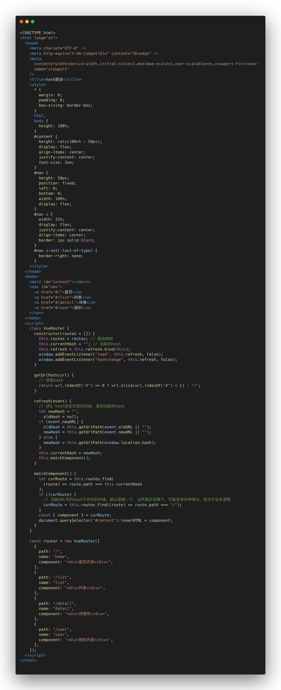
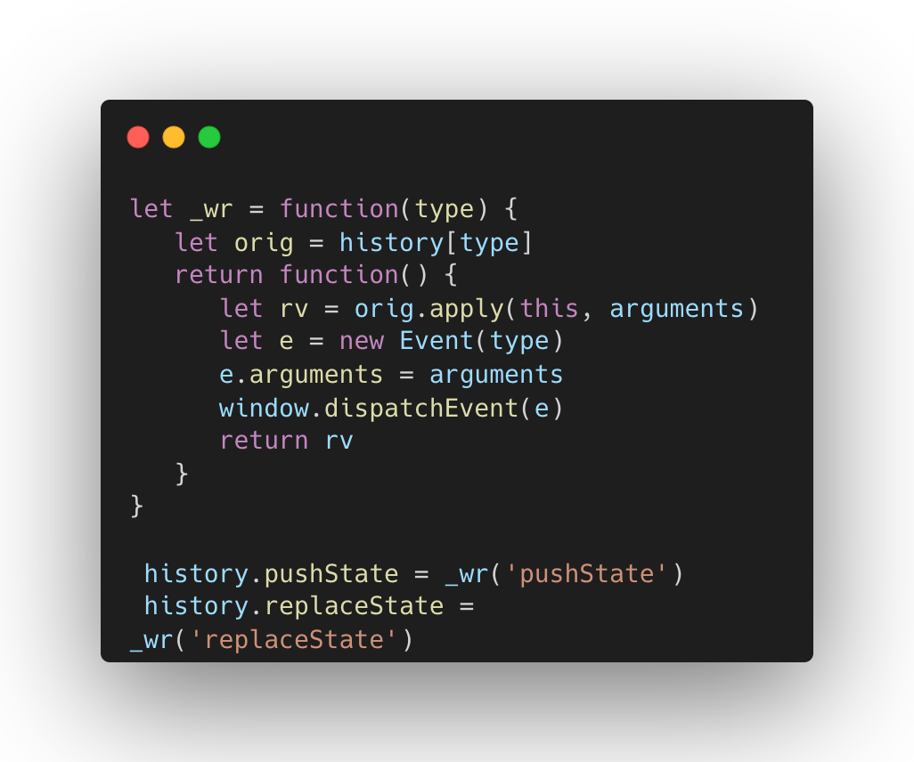
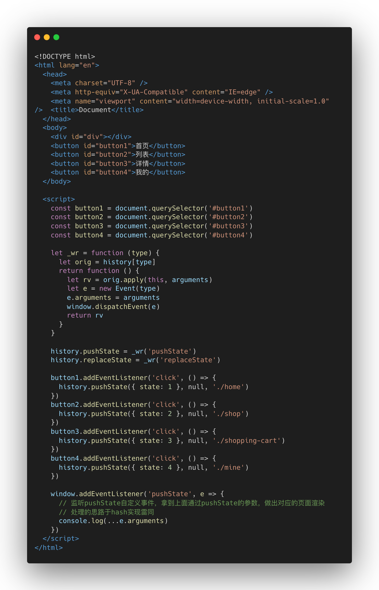

# 前端路由实现方式


## 1 路由的概念

> 路由实现方式主要有两种，分别是hash和history模式。

路由即通过一定的机制，监听用户的行为动作，从而做出对应的变化。

在单页面应用中，通过访问服务器的index.html静态文件，呈现的所有交互，包括点击跳转，数据渲染等皆是在这个唯一页面中完成的。路由的工作即在用户点击页面不同模块时，渲染更新对应的内容区域，并且不需要再次发出请求。


## 2 前端路由的实现方式

### hash模式

我们知道一个URL又很多部分组成，包括协议、域名、路径、query、hash等，我们点击不同模块的时候可能看到的是这样的URL。

- 首页：yourdomain.xxx.com/index.html/#/
- 列表：yourdomain.xxx.com/index.html/#/list
- 详情：yourdomain.xxx.com/index.html/#/detail
- 我的：yourdomain.xxx.com/index.html/#/mine

#号后面的，就是URL中关于hash的组成部分，不同路由对应的hash是不一样的，但都在访问同一个静态资源index.html。我们通过获取URL中关于hash部分发生的变化，从而做出对应的改变。

<u>通过监听浏览器暴露的方法 **hashchange**，在hash改变时触发该事件，这样我们可以在监听事件回调函数中执行展示和隐藏不同UI功能，实现前端路由。</u>

关于hash路由的核心实现：

[代码](https://github.com/Capactity/Blog/blob/main/frontend/index.md)看这里




到这里我们可以得出以下结论：

- hash模式所有的工作在前端完成，无需后端服务的配合。
- hash模式的实现方式即通过监听url中hash部分的变化，从而做出对应的渲染逻辑。
- hash模式下，URL中会携带#。


### history模式

history路由的实现，归功于HTML5提供的history全局对象，依靠于pushState与replaceState实现的。它们具备如下的一些特点。

- 都会改变当前页面显示的url，但不会刷新页面。
- pushState会压入浏览器的会话历史栈中，使得history.length + 1，而replaceState是替换当前的会话历史，因此不会改变history.length。

<u>故此，我们通过**pushState**与**replaceState**实现改变URL而不刷新页面，**popState**触发页面变更渲染。</u>

But，在官方定义里，history.pushState和history.replaceState并不会触发popState事件。但浏览器的某些行为会导致popState触发，比如go、back、forward。这里就需要我们对pushState和replaceState做改造。



执行完上面两个方法后，相当于将pushState和repalceState这两个监听器注册到window上面，定义可参考[EventTarget.dispatchEvent](https://developer.mozilla.org/zh-CN/docs/Web/API/EventTarget/dispatchEvent)。

关于history的核心实现：

[代码](https://github.com/Capactity/Blog/blob/main/frontend/history.md)看这里




#### 注意

在history模式下，如果在跳转路由后再次刷新会得到404的错误，这是因为浏览器会把跳转后的地址当成一个可访问的静态资源路径进行访问，但服务器并没有这个文件

```
http://192.168.30.161:5500/ === http://192.168.30.161:5500/index.html // 默认访问路径下的index.html文件
http://192.168.30.161:5500/home === http://192.168.30.161:5500/index.html // 仍然访问路径下的index.html文件
...
http://192.168.30.161:5500/user === http://192.168.30.161:5500/index.html // 所有的路由都是访问路径下的index.html
```

但在跳转后的路由上刷新页面，会提示报错

```
http://192.168.30.161:5500/user === http://192.168.30.161:5500/user/index.html文件 //服务器上并没有该资源
```

所以，需要在nginx上配置跳转，当访问不存在的资源时，默认指向静态资源index.html

```
location / {
  try_files $uri $uri/ /index.html;
}
```


## 1 hash和history的区别

- hash的实现全部在前端，不需要后端服务器配合，兼容性好，主要通过**hashchange**事件，处理前端业务逻辑。
- history实现，需要服务器做以下简单的配置，通过监听**pushState**及**replaceState**事件，处理前端业务逻辑。

