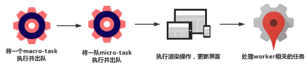

# EventLoop设计原理

> `Event Loop`即事件循环。是指浏览器或`Node`的一种解决`Javascript`单线程运行时不会阻塞的一种机制，即我们经常使用异步的原理，具体分为宏任务和微任务。


**宏任务（MacroTask）:**  `setTimeout`、`setInterval`、`requestAnimationFrame`、**Ajax**、**fetch**、`script 标签代码`、`I/O操作`、`UI渲染`等。

**微任务（MicroTask）:**  `Promise.then`、`MutationObserver`、`Object.observe`。


## 浏览器中的Event Loop

> 在浏览器环境下，当某个宏任务执行完后，会查看是否有微任务队列，如果有，先执行微任务队列中的所有任务，如果没有，会读取宏任务队列中排在最前的任务，执行宏任务的过程中，遇到微任务，会依次加入微任务队列。当栈空后，再此读取微任务队列里的任务，依次类推。





````typescript
Promise.resolve().then(()=>{
  console.log('Promise1')
  setTimeout(()=>{
    console.log('setTimeout2')
  },0)
})
setTimeout(()=>{
  console.log('setTimeout1')
  Promise.resolve().then(()=>{
    console.log('Promise2')
  })
},0)

// 输出结果：
Promise1
setTimeout1
Promise2
setTimeout2
````

- ​	先执行同步任务，执行完毕。查看是否有微任务，执行微任务队列的`Promise1`，同时生成一个宏任务`setTimeout2`。
- 查看宏任务队列，宏任务`setTimeout1`在`setTimeout2`之前，先执行`setTimeout1`，输出`setTimeout1`。
- 在执行宏任务`setTimeout1`是会生成微任务`Promise2`，放入微任务队列中，接着先去清空微任务队列中的所有任务，输出`Promise2`。
- 清空完微任务队列中的任务后，又去宏任务队列中取一个，执行并输出`setTimeout2`。


## Node中的Event Loop

> Node采用v8作为js的解析引擎，`I/0`处理使用`libuv`，`libuv`库负责Node API的执行。将不同的任务分配给不同的线程，形成一个Event Loop，以异步的方式将任务的执行结果返回给V8引擎。

[^libuv]: 基于I/O事件驱动的跨平台抽象层，封装不同操作系统的底层特性，对外提供统一的API，包含事件循环机制


#### 共6个阶段

- **timers阶段**：这个阶段执行timer（setTimeout、setInterval）的回调。
- **I/O callbacks阶段**：处理一些上一轮循环中的少数未执行的 I/O 回调。
- Idle、prepare阶段：仅node内部使用
- poll阶段：获取新的I/O事件, 适当的条件下node将阻塞在这里
- check阶段：执行 setImmediate() 的回调
- close callbacks阶段：执行 socket 的 close 事件回调


## Node与浏览器的Event Loop差异

> 浏览器环境下，微任务的任务队列是每个宏任务执行完之后执行。在执行微任务时，如果又产生了微任务，会还是放在本次任务执行队列中去执行。

> 在node中，微任务会在时间循环的各个阶段之间执行，执行完一个宏任务后，执行“一定数量”的微任务。具体数量根据I/O回调决定。