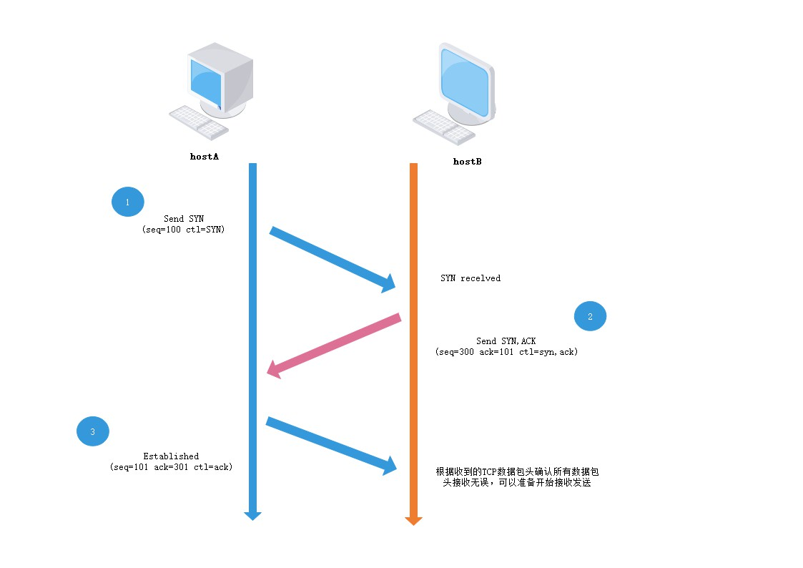

# 从输入url到页面显示的全过程


## 1 域名DNS解析

用户输入内容，进行URL 解析（编码），根据 dns 系统进行 ip 查找。


### 1.1 url解析

网络规定url只能是数字和字母及特殊字符组成，里面可能携带参数，如不解析可能会出现歧义。


URL 主要由 `协议`、`主机`、`端口`、`路径`、`查询参数`、`锚点`6部分组成！


url编码的规则：

- 取决于html头部meta中charset的设定。
- 一般为utf-8。但不同的操作系统、不同的浏览器、不同的网页字符集，将导致完全不同的编码结果。
- 使用javascript对URL进行编码来统一格式。


编码方法：**encodeURI / encodeURIComponent**

- **encodeURI**  ： 对整个url编码（除网页特殊字符），输出utf-8格式，在每个字节前加%，但不编码单引号。
- **encodeURIComponent**  ： 编码范围更广，对url的组成部分进行个别编码（包括网页特殊字符），编码方式一致。


### 1.2 真实地址查询 - DNS

dns解析流程，并且html如何做dns优化？   


例如查询`www.server.com`的IP，当你敲下回车键的一瞬间：

1. 检查**浏览器缓存**中是否存在该域名与IP地址的映射关系，如果有则解析结束，没有则继续。
2. 到**系统本地**查找映射关系，一般在`hosts`文件中，如果有则解析结束，否则继续。
3. 到**本地域名服务器**去查询，有则结束，否则继续。
4. **本地域名服务器**查询**根域名服务器**，该过程并不会返回映射关系，只会告诉你去下级服务器(顶级域名服务器)查询。
5. **本地域名服务器**查询**顶级域名服务器**(即`com`服务器)，同样不会返回映射关系，只会引导你去二级域名服务器查询。
6. **本地域名服务器**查询**二级域名服务器**(即`server.com`服务器)，引导去三级域名服务器查询。
7. **本地域名服务器**查询**三级域名服务器**(即`www.server.com`服务器)，此时已经是最后一级了，如果有则返回映射关系，则**本地域名服务器**加入自身的映射表中，方便下次查询或其他用户查找，同时返回给该用户的计算机，没有找到则网页报错。
8. 如果还有下级服务器，则依此方法进行查询，直至返回映射关系或报错。


#### 递归查询 / 迭代查询

像该过程中的第1、2、3点，仅限于在`本地域名服务器`中查找，如果有则直接返回映射关系，否则就去其他`DNS`服务器中查询，这种查询方式我们叫做**递归查询**。

第3、4、5、6、7、8过程，他们只会给出下级`DNS`服务器的地址，并不会直接返回映射关系，这种查询方式叫做**迭代查询**。

  

总结：通过 DNS 来查询 IP 地址 • DNS 先查本地、后查运营商、逐级网上查。（域名解析是从后往前查的）


html做DNS优化可以在头部写入DNS缓存地址优化。

````javascript
<meta http-equiv="x-dns-prefetch-control" content="on" />
<link rel="dns-prefetch" href="http://bdimg.share.baidu.com" />
````


#### 查询到ip后，发起http请求。


## 2 HTTP请求

客户端发起资源请求，进行进程之间的通信。


### 2.1 TCP/IP（http）协议。

tcp/ip传输控制协议将应用层、表示层、会话层合并为应用层，传输层、网络层、物理层和数据链路层合并为网络接口层。


**问题2**: http1.x和http2、http3的区别。

**新的二进制格式**、**多路复用（共享连接）、header压缩、服务端推送。**

**三次握手**

   第一次握手：主机A向服务器发送位码为SYN＝1的TCP包。随机产生一个确认号seq number，服务器收到SYN=1后知道了 A要求建立连接。（第一次握手，由浏览器发起，告诉服务器我要发送请求了）。

  第二次握手：主机B收到请求后，向A发送确认号 ack number =（主机A的seq+1），syn=1，seq = 随机数 的TCP包。（第二次握手，由服务器发起，告诉浏览器我准备接受了，你赶紧发送吧）。

  第三次握手：主机A收到后检查ack7是否码与SYN码正确，再发送ack number =（服务器的seq+1）,服务器收到后确认ack与seq码，建立连接。（第三次握手，由浏览器发送，告诉服务器，我马上就发了，准备接受吧）。



**拓展： 负载均衡还有网关，cdn，服务器常见的结构，发布流程**


#### 3 建立连接后，请求html文件，如果html文件在缓存里浏览器直接返回，如果没有，就去后台拿。


 **问题1**: 解释下缓存？

浏览器首次加载，缓存资源及 请求头header里的date等属性一并缓存。

二次加载，缓存资源及 请求头header里的date等属性一并缓存。