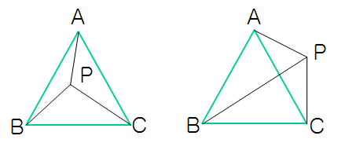
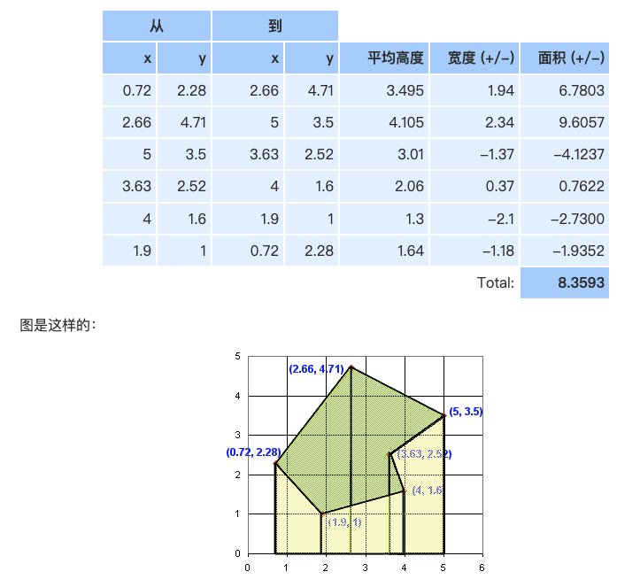

# ThreeJs基础

## 正交投影 / 透视投影的概念

## webgl的一次绘制，需要经过大致的以下几个阶段。

- 创建webgl的应用程序Program，从文本编译并使用shader
- 将三维几何数据通过attribute传送给GPU
- GPU执行顶点着色器，处理顶点数据
- GPU执行片元着色器，处理颜色等数据
- 将执行结果写入缓冲区（用于显示到屏幕或者后处理）

## 什么是shader

顶点着色器：大部分就是在处理顶点的矩阵变换，将顶点的位置通过MVP矩阵乘法最终变换到裁剪空间。

片元着色器：在整个渲染中起到了非常大的作用，一般颜色，贴图采样，光照，阴影等计算都会在片元着色器中计算。

## WebGLRenderer的渲染过程

简单理解就是，把我们绘制的场景图，通过相机视椎体的范围来截取，转化为一张图片。然后去绑定页面上`canvas元素`把这张图片绘制到元素上。动画效果就是不断的生成新的图片替换原来的图片来实现的。渲染器上有很多属性和方法，都是配合其他内容一起使用的，比如阴影就需要灯光和几何体来配合才能展示。

**WebGLRenderer** 把渲染流程分为三个部分。下面的源码已经精简过，并带上了一些注释, 可以参考流程图试着去走一遍流程。

- 预处理：对该次需要渲染物体数据进行初始化分类，根据不透明、透明、透射特性分组、预添加物体。
- 阴影、物体渲染：根据数据计算位置数量，调用webGL原生api渲染
- 后处理：清理过程变量，清理数组及状态。

## 三维物体如何判断选中

three.js的物体选中，主要是通过光线投射Raycaster进而运算得到

1. 初始化 raycaster = new THREE.Raycaster
2. 监听鼠标位置，获取鼠标位置，通过将三维坐标转屏幕坐标 new THREE.Vector3(x,y,z)
3. 更新射线，计算相机照射到鼠标的光线，找到和射线相交的对象，返回数组。

## 判断两条线段是否相交

判断两条连线的向量乘是否为0，为0则表示平行，否则相交

## 如何快速选中三角形、多边形

#### **1 面积法**

如果点p在三角形ABC内部，则三个小三角形面积PAB、PBC、PAC 之和等于ABC的面积，反之则不等。

#### **2 向量法**

可以使用向量的叉乘，假设三角形的三个点按照顺时针顺序为A、B、C。对于某一点P，求出三个向量PA、PB、PC:

t1 = PA^PB,

t2 = PB^PC,

t3 = PC^PA,

如果t1，t2，t3同号（同正或同负）则方向相同，说明点P在三角形每条边的同侧即内部，那么P在三角形内部，否则在外部。

### 判断点是否在多边形内

#### 1 面积法

判断目标点与多边形组成的三角形面积和是否等于该多边形。

**不规则多边形计算面积公式**：求每条线段下面与x轴之间的阴影面积，求两个高度的平均值，再乘以宽度。最后把所有面积加起来，注意，前进时的面积要加上，后退时的面积要减去。

#### 2 引射线法

从目标点出发引一条射线，看这条射线和多边形所有边的交点数目，如果为奇数则在多边形，反之则在物体外。

## 点积、叉乘

## 讲一下四元素原理，怎么实现旋转

## 手写旋转、平移、缩放矩阵

