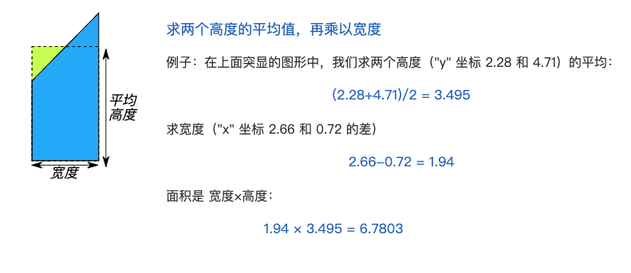

# ThreeJs基础

## 正交投影 / 透视投影的概念

## 三维坐标如何变成屏幕坐标，坐标系转换

## 判断两条线段是否相交

判断两条连线的向量乘是否为0，为0则表示平行，否则相交

## 如何快速选中三角形、多边形

#### **1 面积法**

如果点p在三角形ABC内部，则三个小三角形面积PAB、PBC、PAC 之和等于ABC的面积，反之则不等。

#### **2 向量法**

可以使用向量的叉乘，假设三角形的三个点按照顺时针顺序为A、B、C。对于某一点P，求出三个向量PA、PB、PC:

t1 = PA^PB,

t2 = PB^PC,

t3 = PC^PA,

如果t1，t2，t3同号（同正或同负）则方向相同，说明点P在三角形每条边的同侧即内部，那么P在三角形内部，否则在外部。

### 判断点是否在多边形内

#### 1 面积法

判断目标点与多边形组成的三角形面积和是否等于该多边形。

**不规则多边形计算面积公式**：求每条线段下面与x轴之间的阴影面积，求两个高度的平均值，再乘以宽度。最后把所有面积加起来，注意，前进时的面积要加上，后退时的面积要减去。

#### 2 引射线法

从目标点出发引一条射线，看这条射线和多边形所有边的交点数目，如果为奇数则在多边形，反之则在物体外。

## WebGLRenderer的渲染过程

## 点积、叉乘

## 讲一下四元素原理，怎么实现旋转

## 手写旋转、平移、缩放矩阵

## 三维物体如何判断选中

three.js的物体选中，主要是通过光线投射Raycaster进而运算得到

1. 初始化 raycaster = new THREE.Raycaster
2. 监听鼠标位置，获取鼠标位置，通过将三维坐标转屏幕坐标 new THREE.Vector3(x,y,z)
3. 更新射线，计算相机照射到鼠标的光线，找到和射线相交的对象，返回数组。

